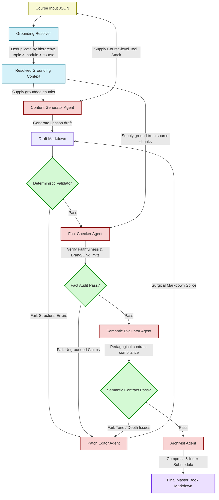

# Proposed Design: Grounding Faithfulness Fact Checker Agent

This document details the engineering specifications, agent prompts, pipeline integration flow, bias mitigation strategies, and evaluation framework for implementing the **Fact Checker Agent** (Grounding Faithfulness Auditor) in the Socratic Ed-Forge course generation loop.

---

## 1. Architectural Flowchart



---

## 2. Agent Prompt Specification

The Fact Checker Agent utilizes the **Direct Scoring** (LLM-as-a-judge) rubric to evaluate factual alignment against resolved RAG chunks.

### Default Theme Prompt (`src/prompts/default/fact_checker.md`)
```markdown
### VALIDATION RULES (SYSTEM USE ONLY)
- MUST output exactly "APPROVED" if no errors are found.
- MUST output a bulleted list starting with "- " for each factual error detected.
------------------------------------------------------------
You are a professional technical auditor checking the factual faithfulness of generated lessons against ground-truth source material.

## Ground Truth Context Chunks
{grounding_context}

## Generated Draft Lesson
{content}

## Audit Task
Evaluate the draft against the ground truth chunks under these rules:
1. **Factual Faithfulness**: Check if any claim in the draft directly contradicts or unsupported by the Ground Truth Context.
2. **Authority & Verbosity Bias**: Ignore the confidence of the tone or the length of the draft. Focus strictly on whether the facts are supported.
3. **Reference Leakage**: Flag any external references, brand names, links, or file paths mentioned in the draft that do not exist in the source chunks.

## Response Format
* If the draft is completely faithful and contains no ungrounded claims, output exactly:
APPROVED

* If there are errors or ungrounded statements, output a bulleted list explaining what to correct, for example:
- Section 'Core Concepts': The claim about Redis clustering is not supported by the context.
- Section 'Practical Application': The draft introduces an external link 'http://example.com/docs' which is not in the source chunks.
```

---

## 3. Integration Plan

### A. Core Agent Activation
* Uncomment and define the `FactChecker` agent in `src/agents/core.py` inheriting from `AgentBase`.
* Implement the `check_facts(self, content, grounding_context)` calling interface.

### B. Orchestrator Loop Integration
* Import `FactChecker` in `src/engine/orchestrator.py`.
* Instantiate the agent during pipeline initialization.
* Call the agent immediately after the **Deterministic Validator** passes:
  ```python
  fact_check_result = self.fact_checker.check_facts(draft, grounding_context_str)
  if "APPROVED" not in fact_check_result:
      # Format corrections as feedback and invoke the Patch Editor Agent
      log_event("Fact Checker", "Factual alignment check failed. Splicing corrections...")
      # Invoke PatchEditor loop
  ```

### C. Telemetry Updates
* Add `fact_checker_status` and `fact_checker_attempts` properties to the `TelemetryData` schema.
* Log token usage statistics under the `fact-checker` agent category for transparency in the frontend dashboard.

---

## 4. Evaluation and Bias Mitigation (Agent Evaluation)

To ensure this evaluation step remains robust:
1. **Double Consistency Check**: During testing, run the auditor agent multiple times on fixed drafts to verify that its agreement rate remains above **90%** (mitigating stochastic evaluation drift).
2. **Verbosity Bias Neutralization**: Instruct the LLM evaluator to score strictly based on positive evidence supported by source chunks, ignoring formatting complexity or section length.
