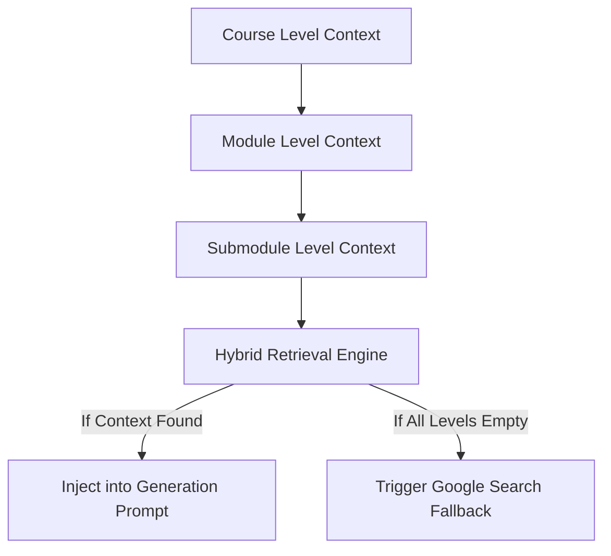

# RAG & Google Search Fallback Design Document

This document outlines the architecture, data extraction pipeline, fallback execution paths, and MCP/local tools configuration for implementing a context-aware hybrid Retrieval-Augmented Generation (RAG) and search fallback engine.

---

## 1. RAG Layer Hierarchy

The RAG engine operates across a three-tiered hierarchical chunking system:



### Hierarchy Breakdown:
1. **Course Level Chunks**: High-level structural details, textbook outlines, or course-wide reference resources.
2. **Module Level Chunks**: Detailed syllabus, learning objectives, and concepts specific to a particular module group.
3. **Submodule (Topic) Level Chunks**: Dense technical guides, code snippets, and specific implementation details for the current topic.

---

## 2. Retrieval & Google Search Fallback Logic

When a submodule lesson is generated, the pipeline executes the following retrieval checklist:

```text
1. Fetch topic-level chunks for the active submodule.
2. Fetch module-level chunks.
3. Fetch course-level chunks.
4. Evaluate combined text length / semantic similarity score.

IF (Combined Chunks are Empty) OR (Similarity Score < threshold):
    LOG: "RAG contexts exhausted. Initializing search fallback..."
    EXECUTE: check_google_search_fallback(submodule_title, module_context)
```

### Scoping Rules for Search:
To prevent the LLM from drifting off-topic, search queries are bounded strictly within the module's scope:
* **Query Format**: `"{module_title} - {submodule_title} - {specific_missing_concept}"`
* **Query Constraints**: Avoid broad queries. Inject parent module topic keywords (e.g., `git merge conflicts` rather than just `conflicts`) to anchor search relevance.

---

## 3. Tool Integrations

For autonomous execution, the system relies on the following tool sets:

### A. Web Search Tools (Fallback API)
* **Tavily / Search Web tool**: Used to retrieve real-time search queries with pre-filtered, markdown-formatted web content snippets.
* **Exa Search (MCP)**: Utilizes neural search query translation to return clean, parsed web pages instead of raw HTML.
* **HasData Web Scraper**: Retrieves raw page contents for deep indexing if a specific domain or link is targeted.

### B. Vector Indexing Tools
* **SentenceTransformers / ChromaDB**: Used locally to chunk markdown files, generate embeddings, and build the hierarchical vector index.

---

## 4. Implementation Guidelines (Continuing the Work)

When implementing the hybrid grounding pipeline in a later session:
1. **Grounding Injection Location**: Inject extracted search snippets into the `module_context` or `content_context` dictionary arguments inside `src/engine/orchestrator.py` before prompting the `ContentGenerator`.
2. **Deterministic Fallback Gate**: Check if retrieval results are empty programmatically before invoking the search API to conserve token quotas.
3. **Calibrated Evaluator**: Ensure the Semantic Evaluator reviews search-grounded text for hallucinated links or external brand mismatches.
