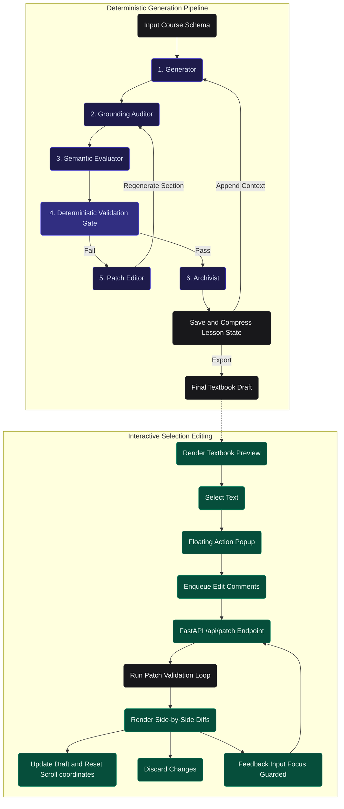

# Socratic Ed-Forge 🚀

**Socratic Ed-Forge** is a professional-grade, agentic AI engine designed to automate the production of high-quality, textbook-ready educational content. 

Using a strict **Deterministic Validation Flow**, the engine replaces unpredictable LLM critique loops with rigid structural rules and targeted semantic evaluation, ensuring every module produced meets strict academic standards without hallucinations.

## ✨ Key Features & New Updates

### 🎨 User Interface & Interactive Review
* **Premium Dark Glassmorphism UI:** A stunning, fully responsive dashboard built with React, Vite, and CSS. Features frosted glass cards, dynamic background gradients, and native resizable sidebars.
* **Interactive Inline Selection Repair:** Allows editors to highlight text spans in the preview panel and trigger surgical inline edits. The engine automatically snaps selections to sentence or paragraph bounds, executes an LLM-guided validation loop, and presents a visual side-by-side diff card.
* **Batch Selection Editing:** Enqueue multiple selection-level comments and instructions across the textbook draft, processing them concurrently in a single batch operation. Replaces tedious step-by-step editing with a unified diff review flow.
* **Input Focus & Selection Lock:** Focus event guards combined with explicit `select-text` CSS overrides ensure that text-selection locks do not block clicking, focusing, or typing inside edit feedback textareas and buttons.

### ⚡ Navigation, Performance & Layout
* **Persistent Navigation Tab States:** Replaces conditional tab panel unmounting with persistent DOM nodes toggled via Tailwind `.hidden` classes. Tab switches preserve active scrollbar heights, selections, highlights, and local component state natively.
* **Active Tab CPU Rendering Optimizations:** Bypasses virtual DOM diffing and component reconciliation trees when tabs are in the background. Uses React reference state tracking to cache elements, capping background tab CPU overhead at zero.
* **Flicker-Free Action Scroll-Locking:** Integrates coordinates caching hooks that intercept actions (staging, accepting, rejecting, or retrying edits) and restore the container's exact `scrollTop` coordinate offsets before repaint, eliminating disorienting scroll jumps.
* **Auto-Scroll Completion Badge:** Status listeners automatically trigger a smooth scroll to the top of the textbook if the user is reading near the header. If scrolled further down, it displays a floating badge: *"✨ Textbook complete! Go to top"* to let the reader return on demand.

### ⚙️ Backend Engine & Pipeline Reliability
* **Deterministic Validation Flow & Fallbacks:** Replaces unpredictable multi-agent critique loops with a deterministic Python ruleset enforcing headers, markdown hierarchy, and placeholders. The validation loop includes fallback return paths to return the last successfully generated patch string, preventing frontend infinite loaders.
* **Graceful Reload Teardown:** Appends shutdown timeout parameters (`--timeout-graceful-shutdown 1`) to the Uvicorn web server execution command, guaranteeing active Server-Sent Events (SSE) stream closures and immediate dev server reloads on code edits.
* **Grounding Faithfulness Auditor:** An integrated AI auditor checking drafts against curriculum source chunks (course, module, topic, and web chunks) to prevent hallucinations, enforce tool-stack boundaries, and block unsupported API claims.
* **Context-Aware Placeholder Classification:** Smart, context-aware parser logic mapping validators and export guards to allow intentional learner-facing template slots (e.g. `[EXPECTED BEHAVIOR]`) inside labeled template examples while strictly blocking authoring markers (e.g. `[TODO]`, `[Insert code here]`).
* **Strict Schema & Nullable Fields Validation:** Enforces rigid input contracts (`extra="forbid"`) to reject unexpected configuration parameters, while gracefully accepting both `null` and empty values (`""`, `[]`) for all optional course fields and grounding/materials arrays.
* **Submodule Telemetry Matrix:** Real-time validation matrix tracking attempt outcomes (`1`, `2`, `3`, or `F`) per submodule across Deterministic, Grounding, and Semantic validation pipelines, fully persisted on resume and rendered dynamically on the frontend.
* **Structured Lesson Themes (`otto2_structured`):** Supports swappable prompt layout styles. The structured theme automatically renders mapped sections (`Core Idea`, `Lesson Breakdown`, `Practical Walkthrough`, `Edge Cases`, `Common Mistakes`, `Action Items`, `Why It Matters`) while treating constraints and expert paths strictly as internal-only generation guidance.
* **Markdown and List Rendering Corrections:** Programmatically sanitizes CRLF line endings, preserves list hierarchy markers outside staging wrappers, and strips duplicate top-level heading tokens inside inline spans.
* **Decoupled Architecture:** React SPA frontend served on Vite, fully decoupled from the asynchronous FastAPI backend engine.
* **Knowledge Architect Wiki:** Auto-documented Markdown codebase wiki with strict metadata structures.
* **Prompt Modularization:** System prompts extracted from source code into modular, maintainable markdown templates.
* **Archival State Management:** An autonomous archivist summarizing completed submodules to preserve target context sizes.
* **Automated Test Suite:** Fast, token-less testing environment using `pytest` and `unittest.mock`.
* **LLM Context Anchors:** Architectural guidelines codified inside `LLM_CONTEXT.md`.


## 🏗️ Architecture



The engine operates on a strict **deterministic validation pipeline**:

1.  **Generator:** Drafts the initial technical content based on the input schema.
2.  **Grounding Faithfulness Auditor:** Audits the draft against the resolved RAG bundle and tool stacks to catch contradictions or ungrounded factual assertions.
3.  **Semantic Evaluator:** Critiques the draft specifically for pedagogical constraints and structural alignment.
4.  **Patch Editor:** Rewrites specific broken sections of the draft based on validation and audit feedback instead of regenerating the entire file.
5.  **Archivist:** Summarizes completed lessons into a concise state to pass as context to the next generation step.
6.  **Validation Gate (Deterministic) & Export Guard:** Not an AI agent, but a deterministic Python script that strictly checks if the draft conforms to structural requirements and checks for placeholder leaks before final export.

## 🛠️ Installation & Setup

1. **Clone the repository:**
   ```bash
   git clone <your-repo-url>
   cd socratic-ed-forge
   ```

2. **Set up the Backend Environment:**
   Install Python dependencies.
   ```bash
   pip install -r requirements.txt
   ```

3. **Set up the Frontend Environment:**
   Install Node.js dependencies for the React app.
   ```bash
   cd frontend-react
   npm install
   cd ..
   ```

4. **Set up Environment Variables:**
   Create a `.env` file in the root directory and add your Google Gemini API key:
   ```env
   GEMINI_API_KEY=your_api_key_here
   ```

## 🚀 Running the Application

You can start the entire application (both Frontend and Backend) with a single command on Windows:

**Double-click `start.bat`** or run it from the terminal:
```cmd
start.bat
```

This script will automatically:
1. Launch the **FastAPI Backend** on `http://localhost:8000`.
2. Launch the **Vite React Frontend** on `http://localhost:5173`.
3. Open your default web browser to the dashboard.

## 📁 Project Structure

```text
socratic-ed-forge/
├── backend/            # FastAPI orchestration endpoints (server.py)
├── frontend-react/     # React + Vite SPA Dashboard
│   ├── src/
│   │   ├── components/ # Shadcn UI components & Control Panels
│   │   ├── hooks/      # useStream hook for Server-Sent Events (SSE)
│   │   ├── App.jsx     # Main Resizable Panel Layout
│   │   └── index.css   # Dark Glassmorphism tokens
├── src/
│   ├── agents/         # Agent core logic (Generator, Critic, Editor, etc.)
│   ├── engine/         # Task orchestrator and Reflective Loop logic
│   ├── prompts/        # Modularized Markdown instructions for AI agents
│   └── utils/          # Real-time console, rate limiters, and file loggers
├── tests/              # Pytest suite with MagicMock for token-less LLM testing
├── wiki/               # Knowledge Architect Markdown DB
├── LLM_CONTEXT.md      # AI context and architecture rules
├── data/               # Output JSONs and generated markdown (Ignored)
├── .env                # API Keys
├── start.bat           # Easy-start script for Windows
└── requirements.txt    # Python dependencies
```

## 🧪 Running a Sample Generation

To start producing content, the engine requires a structured JSON configuration file that defines the course outline. You can upload this JSON via the **Settings/Controls** panel in the React Dashboard.

Here is a comprehensive sample `course_input.json` using the modern `CourseStructure` schema. It showcases both the **required (must-have)** fields and the powerful **optional** features available for fine-tuning generation:

```json
{
  "course_title": "Introduction to AI Engineering",
  "course_context": "A comprehensive guide on building agentic workflows and deterministic AI pipelines.",
  "duration_weeks": 4,
  "student_personas": [
    {
      "name": "Alex",
      "context": "A software engineer transitioning into AI, familiar with Python but new to LLMs."
    }
  ],
  "tool_stack": {
    "tools": ["LangChain", "Gemini API"],
    "tech_stack": ["Python", "FastAPI"]
  },
  "modules": [
    {
      "module_title": "Module 1: Agentic Patterns",
      "module_context": "Understanding how to build reliable AI agents beyond simple chat bots.",
      "learning_outcomes": [
        "Design robust AI workflows",
        "Implement deterministic validation"
      ],
      "module_constraints": [
        "Focus on practical engineering rather than theory"
      ],
      "topics": [
        {
          "topic_title": "Topic 1: The Evaluator-Optimizer Loop",
          "concept": "Using an evaluator agent to critique and patch outputs deterministically.",
          "breakdown": "1. Draft Generation 2. Critique 3. Patch Editing",
          "constraints": "Do not mention outdated models like GPT-2.",
          "edge_cases": "Handling infinite loops when patches fail validation.",
          "action_items": [
            "Implement a basic patch editor"
          ],
          "common_mistakes": [
            "Relying on LLMs to rewrite the entire document instead of surgical patches"
          ],
          "expert_heuristic": "A deterministic pipeline is only as good as its strict parsing rules.",
          "expert_story": "When we first built this at Scale, we noticed LLMs kept drifting...",
          "reference_guides": ["https://platform.openai.com/docs/guides/prompt-engineering"]
        }
      ]
    }
  ]
}
```

### 📝 Course Input Schema Field Reference

The input configuration JSON consists of three nested layers: **Course Level**, **Module Level**, and **Topic Level**. Below is the detailed schema specification for every field.

---

#### 1. Course Level (Root Level Configuration)

| Field Name | Type | Required / Optional | Default Value | Description |
| :--- | :--- | :--- | :--- | :--- |
| `course_title` | `string` | **Required** | None | The official name of the course. |
| `course_context` | `string` | **Required** | None | Overall course summary, focus area, and target outcomes. |
| `duration_weeks` | `integer` | Optional | `4` | Expected duration of the curriculum in weeks. |
| `prompt_theme` | `string` | Optional | `"default"` | Layout style. Options: `"default"` (standard textbook) or `"otto2_structured"` (Hook, Core Idea, Lesson Breakdown, Persona Analogies, Practical Walkthrough, Edge Cases, Common Mistakes, Action Items, Why It Matters). |
| `quality_profile` | `string` | Optional | `"standard"` | Content generation depth profile. Options: `"standard"` or `"textbook"`. |
| `learner_level` | `string` | Optional | `"beginner"` | Target audience expertise level. Options: `"beginner"`, `"intermediate"`, or `"advanced"`. |
| `code_example_style`| `string` | Optional | `"progressive_production"` | Code generation style. Options: `"minimal"`, `"practical"`, `"progressive_production"`, or `"production_first"`. |
| `explanation_depth` | `string` | Optional | `"balanced"` | Generative detail level. Options: `"concise"`, `"balanced"`, or `"deep"`. |
| `enable_google_search`| `boolean` | Optional | `true` | Enables/disables DuckDuckGo web search tool fallback. |
| `student_personas` | `array[object]`| Optional | `[]` | List of target student profile definitions used to construct personalized analogies. (Structure detailed below). |
| `tool_stack` | `object` | Optional | `None` | Allowed software/libraries stack configuration. (Structure detailed below). |
| `lesson_contract` | `object` | Optional | `None` | Custom heading and word limits configuration. **Recommendation:** Omit this entirely to let the theme manager auto-load and scale default contracts. |
| `modules` | `array[object]`| **Required** | `[]` | List of modules comprising the course. |

##### `student_personas` Object Structure
* `name` (`string`, **Required**): The name of the persona (e.g. `"Sarah"`). Used internally to catalog entries; stripped from user-facing text to maintain anonymity.
* `context` (`string`, **Required**): Detailed student background, experience, or role (e.g. `"A traditional sysadmin looking to modernize their skillset with cloud-native tools"`).

##### `tool_stack` Object Structure
* `tools` (`array[string]`, Optional): Specific software, frameworks, or libraries allowed (e.g., `["Docker", "Kubernetes"]`).
* `tech_stack` (`array[string]`, Optional): Core programming languages or system stacks (e.g., `["Python", "FastAPI"]`).

---

#### 2. Module Level Configuration

| Field Name | Type | Required / Optional | Default Value | Description |
| :--- | :--- | :--- | :--- | :--- |
| `module_title` | `string` | **Required** | None | The name of the module (e.g., `"Module 1: Foundations"`). |
| `module_context` | `string` | **Required** | None | The learning context, goals, and focus for this module. |
| `learning_outcomes`| `array[string]`| Optional | `[]` | Key learning achievements targeted for the module. |
| `module_constraints`| `array[string]`| Optional | `[]` | Structural boundaries or exclusions applied to all lessons in the module. |
| `topics` | `array[object]`| **Required** | `[]` | Sub-level array of topics representing individual lessons. |

---

#### 3. Topic Level Configuration

| Field Name | Type | Required / Optional | Default Value | Description |
| :--- | :--- | :--- | :--- | :--- |
| `topic_title` | `string` | **Required** | None | Title of the topic / lesson submodule (e.g. `"Application Deployment Workflow"`). |
| `concept` | `string` | **Required** | None | Core concept, technology description, or theory to explain. |
| `breakdown` | `string` | Optional | `""` | A structured step-by-step conceptual outline for the lesson text. |
| `constraints` | `string` | Optional | `""` | Strict rules for the generation (e.g., `"Never use outdated command syntaxes"`). |
| `edge_cases` | `string` | Optional | `""` | Technical limitations, failure modes, or corner situations to cover. |
| `action_items` | `array[string]`| Optional | `[]` | Hands-on exercises or task items the student must perform to practice. |
| `common_mistakes` | `array[string]`| Optional | `[]` | Traps, syntax gotchas, and typical errors the user should avoid. |
| `evaluation_path` | `string` | Optional | `""` | The checklist criterion used to verify the learner has understood the lesson. |
| `expert_heuristic` | `string` | Optional | `""` | Actionable advice or rule-of-thumb from a senior engineer. |
| `expert_story` | `string` | Optional | `None` | Real-world anecdote or scenario context to reinforce learning. |
| `reference_guides` | `array[string]`| Optional | `None` | External links to official documentation or reference specifications. |
| `inferred` | `boolean` | Optional | `None` | Internal flag marking if this topic was auto-generated by the planner. |
| `inference_rationale`| `string` | Optional | `None` | Explanation of why this topic was inferred as a curriculum requirement. |
| `topic_material_ids`| `array[string]`| Optional | `[]` | File or grounding chunk mappings used in RAG. |

> [!WARNING]
> **No `"analogy"` Property at Topic Level:** Do not add `"analogy": "..."` inside your topics array. The engine enforces strict schema validations (`extra="forbid"`). Individual topic-level analogies are forbidden because analogies are generated dynamically at the course level using the `student_personas` list.

---

Once uploaded, select your **RPM/TPM limits**, choose your **Learner Level** and **Code Style**, and hit **Start Production**.

---
*Developed with the Socratic Ed-Forge Engine.*
